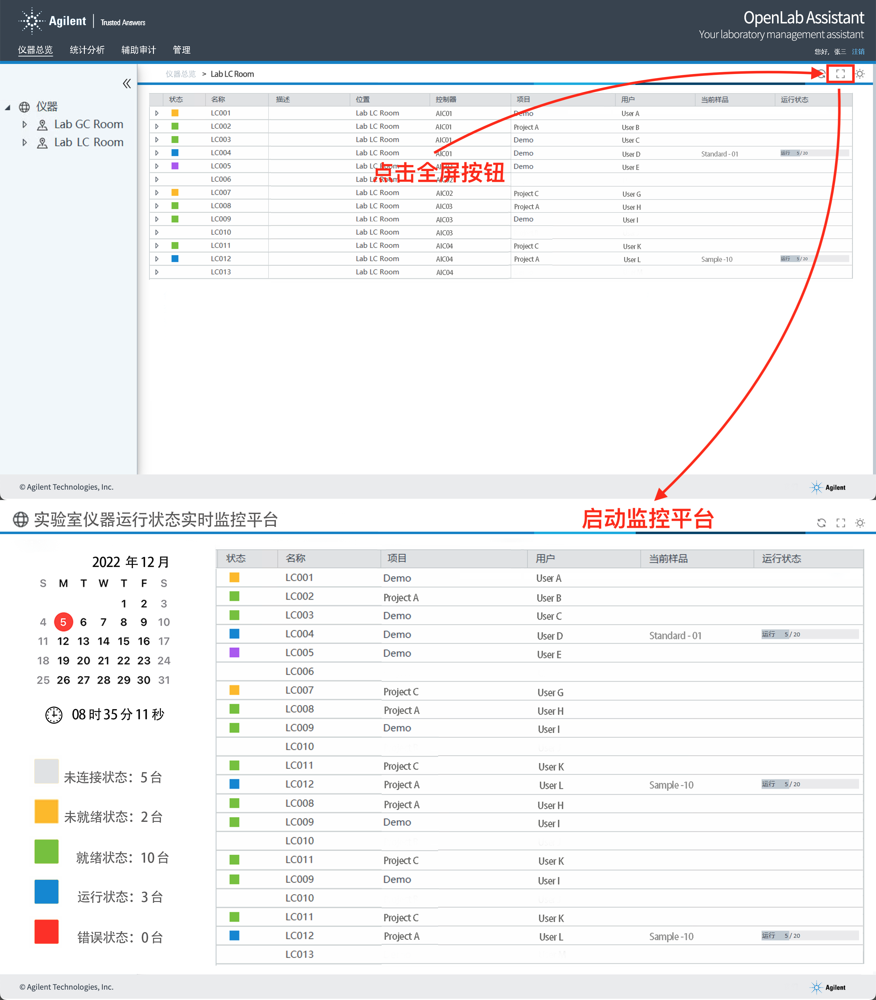
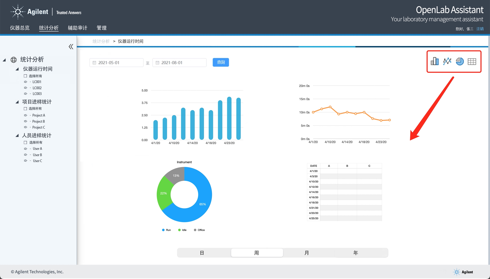

## IAD 需求文档

### 仪器总览

1. UI图

   
2. 字段

   | 字段名称 | 系统字段                    | 说明                                                      |
   | -------- | --------------------------- | --------------------------------------------------------- |
   | 状态     | instrument_status（String） | 仪器状态，比如："CONNECTED"，状态码与颜色对应关系需确认。 |
   | 名称     | instrument_name（String）   | 仪器的名称，比如："IQOQ_RD-PC918_05Jan2020"               |
   | 描述     | description（String）       | TODO check                                                |
   | 位置     | location（String）          | 可以为空，理解为仪器的分组                                |
   | 控制器   | controller（String）        | 上传原始数据的AIC，比如："RD-PC918"                       |
   | 项目     | project_name（String）      | 比如："IQOQ_RD-PC1187_05Jan2021"                          |
   | 用户     | username（String）          | 动态变化                                                  |
   | 当前样品 | current_sample（String）    | 动态变化                                                  |
   | 运行状态 | running_status（String）    | 序列执行情况，"{'current':1, 'total':10}"                 |
3. 功能点说明
   动态展示已有数据
4. 工作拆解

   1. 研究目前获取字段的方式，主要关注“状态”，“项目”，”用户“，“当前样品”，“运行状态” by 锦辉
   2. 研究数据组装和目前 C# 的 API 调用（RESTful） by 李昉

### 统计分析

1. UI图
   
2. 字段

| 字段名称 | 系统字段         | 说明 |
| -------- | ---------------- | ---- |
| 仪器名称 | instrument_name  |      |
| 运行时间 | running_time     |      |
| 进样次数 | experiment_count |      |

3. 功能点说明

   1. 仪器运行时间
   2. 项目进样统计
   3. 人员进样统计
4. 工作拆解
   现有的表结构理清，做数据查询和展示，重点关注如下数据，by 李昉
   -- 1630 IQOQ_RD-PC918_06Jan2021_001.rslt (rslt) 项目信息、仪器信息、方法、序列
   -- 1637 xxx.dx (dx)
   -- 1775 IQOQ_RD-PC918_06Jan2021_001.acaml （acaml_root）

### 仪器状态列表

Not Connect：white；
Idle：Green；
Error：Red；
Pre-run：Purple； 
Running：Blue；
Not Ready：Yellow；
Maintenance Due：Orange；
Sleep：Teal；
